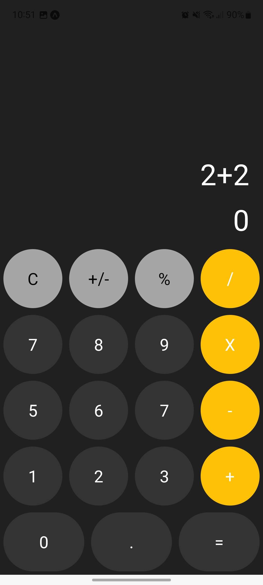
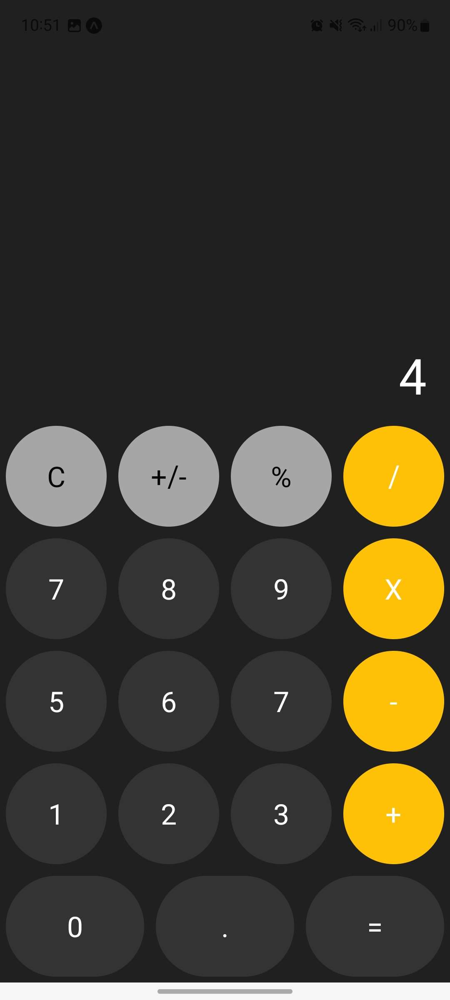
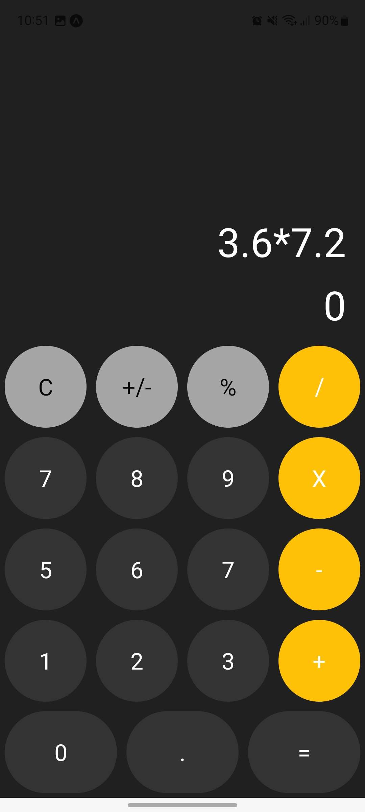
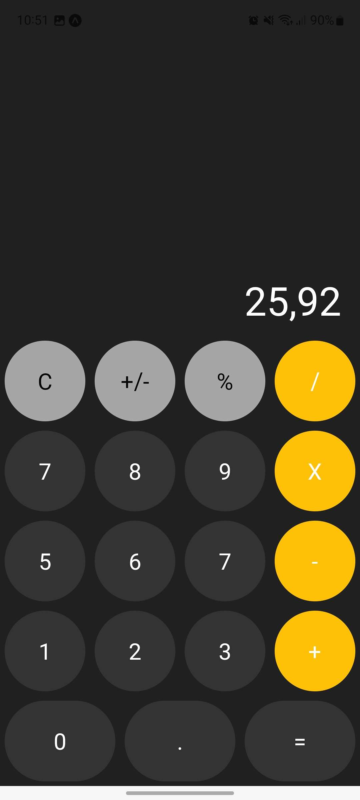
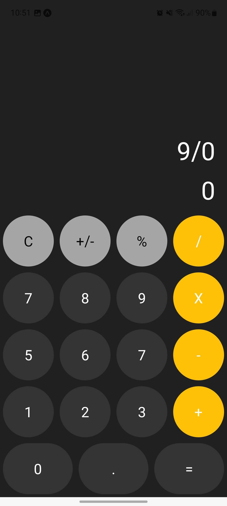
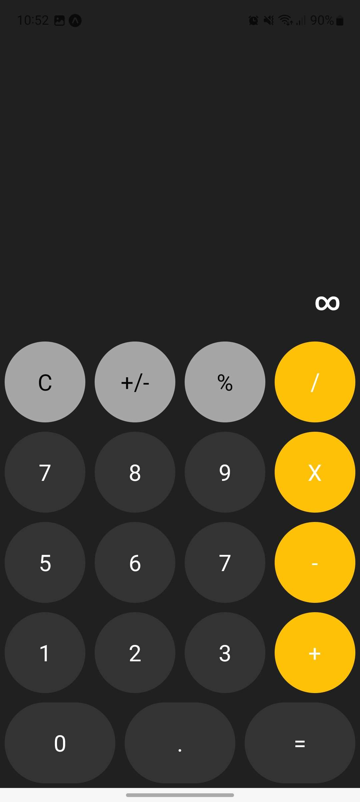

# CDA-ReactNativeCalculator

This app is a straightforward calculator built using React Native and Expo. It performs basic arithmetic operations: addition, subtraction, multiplication, and division.

## Installation

1. Make sure you have Node.js installed on your machine.
2. Install Expo CLI globally by running the following command:
   ```
   npm install -g expo-cli
   ```
3. Clone this repository to your machine:
   ```
   git clone git@github.com:Pixeloceax/CDA-ReactNativeCalculator.git
   ```
4. Navigate to the project directory:

   ```
   cd CDA-ReactNativeCalculator
   ```

5. Install dependencies by running the following command:
   ```
   npm install
   ```

## Configuration

No configuration needed

## Usage

To run the app, execute the following command:

```
npm start
```

This will start the Expo Metro Bundler. You can then scan the generated QR code with the Expo Go app on your mobile device, or run the app in an iOS or Android emulator.

## Features

- Basic arithmetic operations (+, -, \*, /)

## Screens








